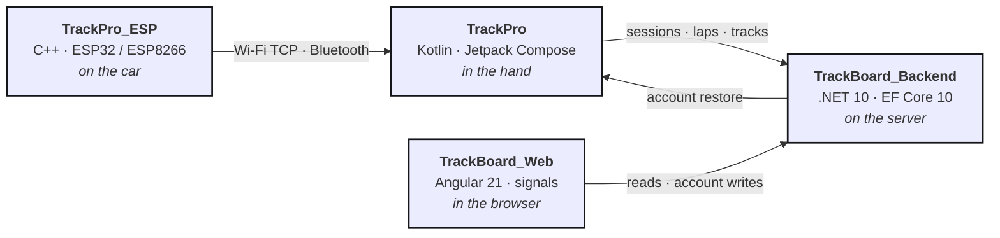

<h1 align="center">Hello traveller! I'm Martin</h1>
<h3 align="center">A Fullstack WebDev from Hungary with an addiction in petrol engines and racing</h3>

## The TrackPro ecosystem

One domain — motorsport telemetry — taken from firmware on the car to a board in the browser.

&nbsp;⟶&nbsp;

&nbsp;⇢&nbsp;

&nbsp;⟵&nbsp;

> **The phone is the source of truth.** It mirrors leaderboard-eligible sessions up to the
> server and restores an account's tracks and sessions back down onto a new device. Auth with
> token refresh, publication, photo upload, leaderboards, profile, JSON export and account
> deletion are wired end to end on both sides.

<b>TrackPro_ESP</b> — the firmware, C++ on ESP32 / ESP8266

Reads a GPS module and pushes position, altitude, satellite count, speed and timestamp over
Wi-Fi — TCP for the lowest latency, with a WebSocket variant alongside it. Ships a Python
simulator so the phone app can be developed and tested with no rig on the bench.

→ [github.com/Aredarn/TrackPro_ESP](https://github.com/Aredarn/TrackPro_ESP)

<b>TrackPro</b> — the app, Kotlin and Jetpack Compose

Lap timing with a live delta against the session best, sector and checkpoint splits, sprint
timing, and drag timing for the quarter mile and 0–100 km/h. A track builder records custom
circuit geometry. Afterwards: lap-versus-lap comparison, speed heatmaps on the map, and a
theoretical best assembled from the best sectors.

Three GPS sources are all first class — ESP32 over Wi-Fi, ESP32 over Bluetooth Classic, and
the phone's own receiver — so nothing in the app may assume the sample rate of the good one.

It is also the TrackBoard client: sign-in with token refresh, background sync of
leaderboard-eligible sessions, photo upload, and a restore path that rebuilds an account's
tracks and sessions on a new phone. **The phone is the source of truth for the whole
ecosystem.**

→ [github.com/Aredarn/TrackPro](https://github.com/Aredarn/TrackPro)

<b>TrackBoard_Backend</b> — the API, .NET 10 and PostgreSQL

Drivers publish the tracks they build, upload a session's laps, and compare best laps on a
public per-track leaderboard. ASP.NET Core on EF Core 10 and PostgreSQL, deployed on Render.
JWT auth, OpenAPI with a Scalar UI, and split liveness and readiness probes so a deployment
can tell the difference between running and ready.

Detail that matters more than the feature list: UUID v7 keys, Mapperly projections so a
leaderboard query stays one round trip, and a pinned transitive dependency closing a
high-severity advisory with auditing on across the whole graph.

The championship model underneath is built and tested but parked, because nothing TrackPro
records maps onto it yet.

→ [github.com/Aredarn/TrackBoard_Backend](https://github.com/Aredarn/TrackBoard_Backend)

<b>TrackBoard_Web</b> — the board, Angular 21 with no UI library

Public: every published track with its outline drawn from driver-published GPS points, a
best-lap classification per track on a shareable link, and a page per driver. Signed in:
season record and personal bests with board position, every uploaded session broken down by
lap and sector, the garage, private tracks, and an account that can export itself to JSON or
delete itself.

Standalone components, signals and `rxResource`, and no UI library at all — the interface is
written, not assembled. Sessions, laps, tracks and cars are read-only here; the web writes
nothing but the account.

→ [github.com/Aredarn/TrackBoard_Web](https://github.com/Aredarn/TrackBoard_Web)

---
